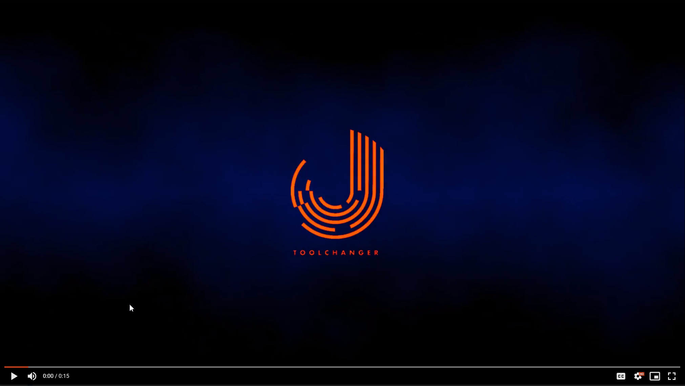

**TAMV _is under active development!_**
# Table of Contents
- [TAMV Walkthrough Video](#tamv-beta-in-action)
- [TAMV = Tool Alignment (using) Machine Vision](#tamv--tool-alignment-using-machine-vision)
- [Why should I use this version/fork of TAMV?](#why-should-i-use-this-versionfork-of-tamv)
- [What's included in this package?](#whats-included-in-this-package)
- [What do I need to run TAMV?](#what-do-i-need-to-run-tamv)
- [What do I need to run ZTATP?](#what-do-i-need-to-run-ztatp)
- [How do I install OpenCV on my Raspberry Pi?](#how-do-i-install-opencv-on-my-raspberry-pi)
- [How do I run these packages?](#how-do-i-run-these-packages)
  * [TAMV_GUI](#tamv_gui)
  * [ZTATP](#ztatp)
  * [TAMV (legacy command-line interface)](#tamv-legacy-command-line-interface)
- [TAMV Community Videos](#tamv-community-videos)

**You can find me (H2B) on the [Jubilee Discord Server](https://discord.gg/XkphRqb) and I'll be more than glad to help you get things up and running.**

# TAMV Beta in Action
We've got a short walkthrough of TAMV in operation up on YouTube, and there you can see a real-time setup and alignment for a 3 tool printer. Click on the image to head over there!

<a href="https://youtu.be/1nGc_hFzK0s?t=5">

_[back to top](#table-of-contents)_
# TAMV = Tool Alignment (using) Machine Vision
Ever needed to simplify nozzle and tool alignment on a toolchanging 3D printer/machine? 

Well, welcome to the wonderful experience of **automated nozzle alignment** and Z offset setting using machine vision (for X&Y offset alignment) and electrical touch plates (for Z offset alignment).

This program significantly improves how tool-changing machines using Duet RRF v2/3 on Duet2 / Duet3 controlers by leveraging open-source computer vision algorithms from the OpenCV project to eliminate the guesswork from tool alignment and (nearly) completely automate the process. Let the machines do the work!

TAMV in its current release is a graphical program that allows you to connect to your printer and automatically calculate tool offsets in XY space using a generic [USB microscope](https://www.amazon.co.uk/gp/product/B07KQDQ4VR/) and a Raspberry Pi (preferably a Pi4 or better).

You may opt to use a webcam for tool alignment, but this approach (while reliable) will need significantly more work to overcome issues related to insufficient/inappropriate lighting and limited depth-of-field of webcam optics (not to mention more sensor noise artifacts), all of which can throw off the computer vision algorithms and cause headaches.

_[back to top](#table-of-contents)_
# Why should I use this version/fork of TAMV?
1. Its now a graphical interface with ZERO command line steps at run-time.
2. Its got a bundled installation script for getting OpenCV 4.5.1 running on a Raspberry Pi (it will take 1.5 hours to install the first time)
3. The program guides you through the alignment process by only enabling the right procedures at the right times.
4. The computer vision functions automatically calibrate your camera output to your machine's movement so there's no need to worry about lens distortion or slightly off-plane images.
5. You may use any USB webcam (no picam yet!) that is compatible with Raspbian (when running TAMV on a Raspberry Pi)
6. You can also use RTSP/network cameras and run the main program on a desktop/laptop if you so prefer (just need Python -- not much benefit over a Raspberry Pi 4 since the computer vision is running some basic blob detection.)
7. *(still pending RC2 release) - TAMV can run repeatability tests for your machine (based on the number of cycles you define) and export/display useful visualizations of how your machine behaves over time to aid in identifying tool drift.*
8. *(still pending RC2 release) - TAMV allows you to save your machine address and some advanced parameters to save you some time when running it multiple times*
9. **Its completely open-source and community driven.**
10. *Did we mention its a graphical interface now?*

_[back to top](#table-of-contents)_
# What's included in this package?
1. **TAMV_GUI.py**: the main interface for automated X/Y offset tool alignment using computer vision
2. **ZTATP.py**: a second program that uses electrical touch plates to physically measure tool Z offsets using your Duet controller's endstop inputs
3. **TAMV.py**: the "original" command line version of TAMV, which also includes data export and repeatability testing

_[back to top](#table-of-contents)_
# What do I need to run TAMV?
1. **A fully functional tool changer platform running RepRapFirmware 2.0.5 or 3.2+**  
   It has only been tested on machines using either Duet2 (+Duex2 or Duex5) or Duet 3 boards.  
   All your toolchanging macros (*tpre, tpost, tfree*) have to be up and running - you can run tool changes cleanly.  
   All of your tools are assumed to have reached a **"safe working area"** once the tool is active (after tpost has completed), and your selected "Controlled Point" (the XY position where your microscope is located) can be reached using a large Y move followed by a large X move (be mindful of collisions here!)  
   You will need to modify your tool change macros to exclude any extrusion moves temporarily to make sure the nozzles are clear of any filament and can be detected reliably. This is still a manual modification and we're working on automating this in the near future.  
   All of your tools must have clean nozzles with no excessive filament deposits surrounding the nozzle.

2. **A Raspberry Pi (3 or better with at least 2GB of RAM)**  
   We prefer a **Raspberry Pi 4 with 4GB of RAM** for a smoother experience, but it will also work on a Model 3 Raspberry Pi.  
   OpenCV requires at least 2GB of RAM to be installed, keep this in mind before jumping into installing openCV. It also takes over an hour to compile OpenCV on a Raspberry Pi 4.

3. **[A generic USB microscope](https://www.amazon.co.uk/gp/product/B07KQDQ4VR/) with the light controls built-in to the USB cable**  
   This is a generic mass-manufactured part commonly found at your favorite ecommerce outlet of choice. **Make sure you are using the variant that has a lighting control wheel built-in to the USB cable**, as there are alternative versions that look very similar which lack lighting control and have been found to be incompatible with Raspbian and will not work.  
   You may choose to use a webcam you already have at home, but be mindful that computer vision requires a specific type of lighting (mainly soft diffuse light directed perpendicular from the camera to the object/nozzle) to work consistently. Webcams also tend to have wide-angle lens optics and offer a very coarse depth of focus, further complicating things when you need to focus on a 0.4mm nozzle from a 25mm focal distance. Add to that webcam sensors typically exhibit a lot of noise artifacts when forced to zoom in so closely to the nozzles. Overall, it will work, but you'll need to fiddle with it until its just right. We all started using TAMV with Logitech C270 webcams, and then moved to microscopes for the vastly superior experience.

4. **A little dose of patience (since you're reading this and already own a toolchanger, then we're sure you've got this bit covered..)**  
   You'll find a great community and ton of help and answers to your questions on the [Jubilee Discord Server](https://discord.gg/XkphRqb)

_[back to top](#table-of-contents)_
# What do I need to run ZTATP?
1. Any **tool changer machine**, just like #1 above for TAMV, running RRF
2. A **Raspberry Pi**, just like #2 above for TAMV  
   You may also choose to use any computer that can run a Python3 script and communicate with your Duet over the local network.

3. Some sort of electrically **conductive touch plate** which you're going to connect to an endstop input (ground) on your Duet board.  
   This can be as simple as a block of aluminum with an electrical wire screwed into it. As long as its electrically conductive and relatively small (under 3 inches on its longest side), you should be OK (size plays a large part in signal noise, so avoid using your printer's build plate..)

4. A second electrical wire that you can hook up to your tools (one at a time, ZTATP pauses and prompts you to connect/disconnect everything for each tool).  
   We can recommend some electrical wire and an alligator clip that you can connect to your nozzle for each alignment sequence.

5. A **multimeter** (REQUIRED!) to test for electrical continuity between your tool nozzle and touch plate before each alignement sequence.  
   We are talking about moving your tool down into a block of metal on your printer bed with ZTATP, so any collisions will definitely lead to machine/tool damage that will cause frustration and expensive repair.

6. **Patience, more so than TAMV**, since you want to make sure each tool is ready to be slowly lowered into a block of solid metal, and you definitely don't want to mess this up.  
   Don't worry. If you do your checks before each probe move, you won't have any crashes (hopefully). 

   **But you are taking full responsibilty and accountability for using ZTATP and we will not be liable for any damages that you may incur.**

_[back to top](#table-of-contents)_
# How do I install OpenCV on my Raspberry Pi?
1. Clone this repository into your home folder
2. Run `~/TAMV/install_opencv.sh`
3. Wait an hour or two for everything to be installed

_[back to top](#table-of-contents)_
# How do I run these packages?
## TAMV_GUI
1. Open a terminal window *from the Raspbian desktop and NOT AN SSH SESSION* and run `~/TAMV/TAMV_GUI.py`
2. Follow the buttons and prompts on-screen. There are tooltips everywhere to guide you!

TAMV.py = Tool Align Machine Vision - for Duet based tool changing 3D printers.

* Runs on the Pi that has the USB or Pi camera 
* Requires network connection to DUET RepRap V2 or V3 based printer.
* This MAY be, but is not required to be, the Pi in a Duet3+Pi configuration
* Requires OpenCV installed on the Pi.  
* MUST run on the graphic console, not SSH.  This can be physical, VNC, or any combination of the two.
* Always use soft diffused lighting when running TAMV (a diffused LED ring works great). This is the most important factor to get it to detect nozzles consistently and reliably without any fuss.

P.S. Reminder: Never NEVER run a graphic app with 'sudo'.  It can break your XWindows (graphic) setup. Badly. 

_[back to top](#table-of-contents)_
## ZTATP
ZTATP.py = Z Tool Align Touch Plate - for Duet based tool changing 3D printers.

* Requires network connection to DUET RepRap V2 or V3 based printer.
* This MAY be, but is not required to be, the Pi in a Duet3+Pi configuration
* Warning: RRF 2&3 have a **hardcoded offset of 0.7mm applied to Z-probes** which you must over-ride in your config.g file. If you don't fix this issue, your offsets will be calculated 0.7mm too close to your print surface **and this will result in damage to your printer!** A simple G31 Z0 at the end of your config.g file (or whatever Z offset applies to your probe) is sufficient to fix this issue. A later release of ZTATP will automatically handle this issue, but for now, it is a manual fix.
### Installation

    See instructions above for TAMV.  It will be in the same directory. 

### Parameters
#### -h, --help            
show help message and exit
  
#### -duet DUET
Name or IP address of Duet printer. You can use -duet=localhost if you are on the embedded Pi on a Duet3.
  
#### -touchplate TOUCHPLATE TOUCHPLATE
x y of center of a 15x15mm touch plate (these can be decimal values)
                        
#### -pin PIN PIN
input pin to which wires from nozzles are attached (only in RRF3)
  
#### -tool TOOL
set a run for an individual tool number

### Run

    cd TAMV
    ./ZTATP.py -touchplate X Y

NOTE: Requires Wiring! Each nozzle must be wired to the GPIO specified (default is io5.in, can be overriden on command line).  The touchplate must be grounded. Recommend about running with finger on power switch, in case a given touch does not stop. 

_[back to top](#table-of-contents)_
## TAMV (legacy command-line interface)
### Preparation steps
TAMV, ZTATP, and their associated plot functions utilize Python3+, and some additional libraries for GUI elements and processing. If you have some errors while running the code, consider running the following commands to install missing modules.

    sudo apt-get update
    sudo apt-get upgrade
    sudo apt-get install python3-matplotlib
    sudo apt-get install python3-pyqt5

### Installation

    cd
    git clone https://github.com/HaythamB/TAMV/

### Run
    usage: TAMV.py [-h] [-duet DUET] [-vidonly] [-camera CAMERA] [-cp CP CP]
                   [-repeat REPEAT] [-xray] [-loose] [-export] [-alternate]
    
    Program to allign multiple tools on Duet based printers, using machine vision.
    
    optional arguments:
      -h, --help      show this help message and exit
      -duet DUET      Name or IP address of Duet printer. You can use
                      -duet=localhost if you are on the embedded Pi on a Duet3.
      -vidonly        Open video window and do nothing else.
      -camera CAMERA  Index of /dev/videoN device to be used. Default 0.
      -cp CP CP       x y that will put 'controlled point' on carriage over
                      camera.
      -repeat REPEAT  Repeat entire alignment N times and report statistics
      -xray           Display edge detection output for troubleshooting.
      -loose          Run circle detection algorithm with less stringent
                      parameters to help detect worn nozzles.
      -export         Export repeat raw data to output.csv when done.
      -alternate      Try alternative nozzle detection method

_[back to top](#table-of-contents)_

# TAMV Community Videos
## Danal's Original TAMV Release
You can find the original release of [TAMV in Danal Estes' repository](https://github.com/DanalEstes/TAMV)

## Walkthrough: Luke's Laboratory

## Walkthrough: Reefing Ninja

_[back to top](#table-of-contents)_